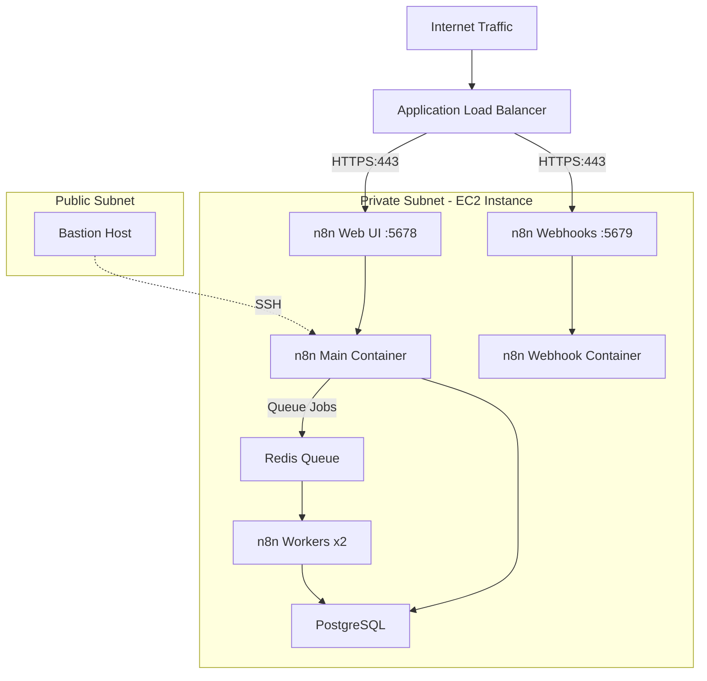

# n8n Production Setup for AWS

A production-ready Docker-based n8n workflow automation platform with queue-based execution. Simple, secure, and scalable deployment on AWS EC2.

## Architecture Overview



## Key Features

- **Queue-Based Execution**: Redis-backed job queue for reliable workflow processing
- **Multi-Worker Setup**: 2 dedicated worker containers for parallel execution
- **Production Ready**: Health checks, graceful shutdowns, and persistent data
- **Puppeteer Integration**: Built-in Chrome/Chromium for advanced web scraping
- **Secure**: Deployed in private subnet with ALB for external access
- **High Performance**: Optimized for concurrent workflow execution

## Infrastructure Requirements

### AWS Resources
- **VPC**: Private subnet for n8n, public subnet for ALB and bastion
- **EC2 Instance**: t3.large minimum (8GB RAM, 2 vCPU) in private subnet
- **Application Load Balancer**: Routes traffic to n8n services
- **Security Groups**: Properly configured for ALB → EC2 communication
- **Route53**: DNS records for your domain
- **ACM Certificate**: SSL/TLS certificate for HTTPS

### Domain Configuration
Your infrastructure supports:
- Primary domain: `n8n.matanweisz.xyz` (Web UI)
- API domain: `api.n8n.matanweisz.xyz` (Webhooks)

## Terraform Infrastructure

Your current Terraform configuration is **perfect as-is** for this n8n deployment. No changes needed!

The infrastructure includes:
- ✅ **Correct ports**: 5678 for web UI, 5679 for webhooks
- ✅ **Health check**: Custom `/healthz` endpoint
- ✅ **Security groups**: Properly configured ALB → EC2 access
- ✅ **Load balancing**: Separate target groups for web and API traffic

## Step-by-Step Deployment Guide

### Prerequisites
- AWS infrastructure deployed with your Terraform configuration
- SSH access to EC2 instance via bastion host
- Domain configured in Route53 with ACM certificate

### Step 1: Connect to EC2 Instance

```bash
# SSH to bastion host
ssh -i ~/.ssh/your-key.pem ubuntu@<bastion-public-ip>

# From bastion, SSH to n8n server
ssh -i ~/.ssh/your-key.pem ubuntu@<n8n-private-ip>
```

### Step 2: Prepare EC2 Instance

```bash
# Update system
sudo apt update && sudo apt upgrade -y

# Install Docker
curl -fsSL https://get.docker.com -o get-docker.sh
sudo sh get-docker.sh

# Add user to docker group
sudo usermod -aG docker ubuntu
newgrp docker

# Install Docker Compose
sudo apt install docker-compose-plugin -y

# Verify installation
docker --version
docker compose version
```

### Step 3: Deploy n8n

```bash
# Clone repository
git clone <your-repo-url> n8n-production
cd n8n-production

# Copy and configure environment
cp .env.example .env
nano .env
```

### Step 4: Configure Environment Variables

Edit `.env` file with your settings:

```bash
# Database Configuration
POSTGRES_PASSWORD=your-secure-password-here
N8N_ENCRYPTION_KEY=your-32-character-encryption-key
N8N_USER_MANAGEMENT_JWT_SECRET=your-jwt-secret-here
N8N_RUNNERS_AUTH_TOKEN=your-runner-auth-token

# Domain Configuration (match your Terraform)
N8N_HOST=n8n.matanweisz.xyz
N8N_WEBHOOK_URL=https://api.n8n.matanweisz.xyz/

# Performance Configuration
N8N_CONCURRENCY_PRODUCTION_LIMIT=10
N8N_QUEUE_BULL_GRACEFULSHUTDOWNTIMEOUT=300
N8N_GRACEFUL_SHUTDOWN_TIMEOUT=300

# Queue Configuration
EXECUTIONS_MODE=queue
QUEUE_BULL_REDIS_HOST=redis
QUEUE_HEALTH_CHECK_ACTIVE=true
```

### Step 5: Start Services

```bash
# Create external network
docker network create shark

# Start all services
docker compose up -d

# Verify services are running
docker compose ps

# Check logs
docker compose logs n8n
docker compose logs n8n-worker
```

### Step 6: Access n8n

1. **Wait for health checks to pass** in AWS console
2. **Open browser** to: `https://n8n.matanweisz.xyz`
3. **Complete initial setup** and create admin user
4. **Test webhook endpoint**: `https://api.n8n.matanweisz.xyz/webhook/test`

## Service Management

### Monitor Services
```bash
# Check all service status
docker compose ps

# View logs for specific service
docker compose logs n8n
docker compose logs n8n-worker
docker compose logs postgres
docker compose logs redis

# Follow logs in real-time
docker compose logs -f n8n
```

### Scale Workers (Optional)
```bash
# Scale to more workers if needed
docker compose up -d --scale n8n-worker=3

# Scale back down
docker compose up -d --scale n8n-worker=2
```

### Service Operations
```bash
# Restart specific service
docker compose restart n8n

# Stop all services
docker compose down

# Start services
docker compose up -d

# Update services (after pulling new images)
docker compose pull
docker compose up -d
```

## Configuration Reference

### Core Environment Variables

| Variable | Description | Required | Example |
|----------|-------------|----------|---------|
| `N8N_ENCRYPTION_KEY` | 32-character encryption key | Yes | `a1b2c3d4e5f6...` |
| `POSTGRES_PASSWORD` | Database password | Yes | `secure_password` |
| `N8N_HOST` | Your n8n domain | Yes | `n8n.example.com` |
| `N8N_WEBHOOK_URL` | Webhook base URL | Yes | `https://api.example.com/` |

### Performance Tuning

| Variable | Description | Default | Recommendation |
|----------|-------------|---------|----------------|
| `N8N_CONCURRENCY_PRODUCTION_LIMIT` | Jobs per worker | 10 | 10-20 for high load |
| `N8N_QUEUE_BULL_GRACEFULSHUTDOWNTIMEOUT` | Shutdown timeout | 300s | Match longest workflow |
| `N8N_GRACEFUL_SHUTDOWN_TIMEOUT` | Container stop timeout | 300s | Match shutdown timeout |

## Queue System

The system uses Redis-backed BullMQ for reliable job processing:

- **Main container**: Receives workflows and queues jobs
- **Worker containers**: Process jobs from queue (2 by default)
- **Redis**: Stores job queue and state
- **PostgreSQL**: Stores workflow definitions and execution history

### Queue Monitoring
```bash
# Check queue length
docker compose exec redis redis-cli LLEN bull:jobs:wait

# Monitor queue in real-time
watch "docker compose exec redis redis-cli LLEN bull:jobs:wait"

# View Redis info
docker compose exec redis redis-cli info
```

## Troubleshooting

### Common Issues

**Services Won't Start**
```bash
# Check logs for errors
docker compose logs <service-name>

# Verify network exists
docker network ls | grep shark

# Check disk space
df -h
```

**Database Connection Failed**
```bash
# Test database connection
docker compose exec postgres psql -U n8n -d n8n -c "SELECT version();"

# Check database logs
docker compose logs postgres
```

**ALB Health Check Failing**
```bash
# Test local n8n response
curl -I http://localhost:5678/healthz

# Verify security groups allow ALB → EC2 on ports 5678/5679
```

**High Memory Usage**
```bash
# Check container memory usage
docker stats

# Scale down workers if needed
docker compose up -d --scale n8n-worker=1

# Restart services to clear memory
docker compose restart
```

### Performance Issues

**Slow Workflow Execution**
- Increase worker count: `docker compose up -d --scale n8n-worker=3`
- Increase concurrency: Set `N8N_CONCURRENCY_PRODUCTION_LIMIT=15`
- Monitor queue length: `docker compose exec redis redis-cli LLEN bull:jobs:wait`

**Database Performance**
- Monitor PostgreSQL logs: `docker compose logs postgres`
- Consider increasing EC2 instance size for more RAM
- Check database connections: `docker compose exec postgres psql -U n8n -c "SELECT count(*) FROM pg_stat_activity;"`

## Production Recommendations

1. **Instance Sizing**: Use t3.large minimum (8GB RAM) for production
2. **Monitoring**: Set up CloudWatch alarms for instance health
3. **Backups**: Implement automated PostgreSQL backups
4. **Updates**: Regularly update Docker images and system packages
5. **Security**: Rotate secrets and encryption keys periodically

## Security Features

- ✅ **Private Subnet**: EC2 instance not directly accessible from internet
- ✅ **ALB Termination**: HTTPS terminated at load balancer
- ✅ **Security Groups**: Minimal required access between components
- ✅ **Encrypted Storage**: Database and Redis data encrypted at rest
- ✅ **Bastion Access**: Secure SSH access through bastion host

## Support

For deployment issues:
1. **Check logs**: `docker compose logs <service>`
2. **Verify connectivity**: Test ALB → EC2 communication
3. **Monitor resources**: Check CPU/memory usage
4. **Review configuration**: Ensure environment variables are correct

This setup provides a robust, production-ready n8n environment with queue-based execution and proper AWS integration.